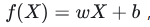
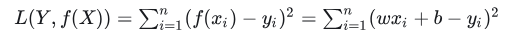
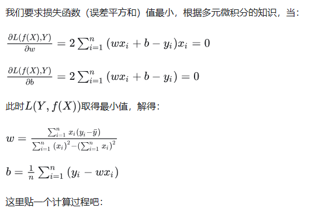
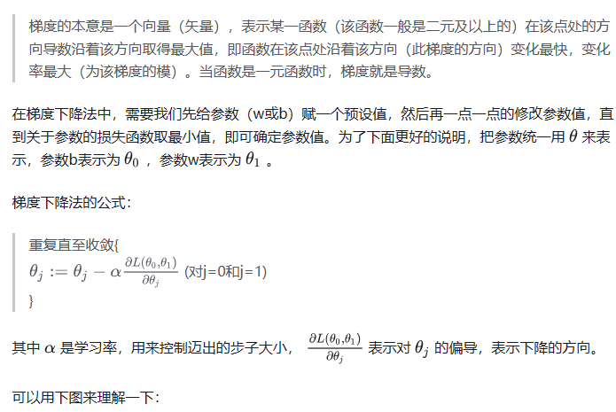
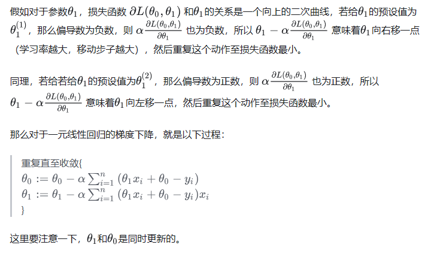
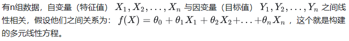
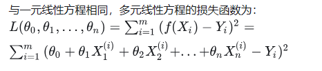
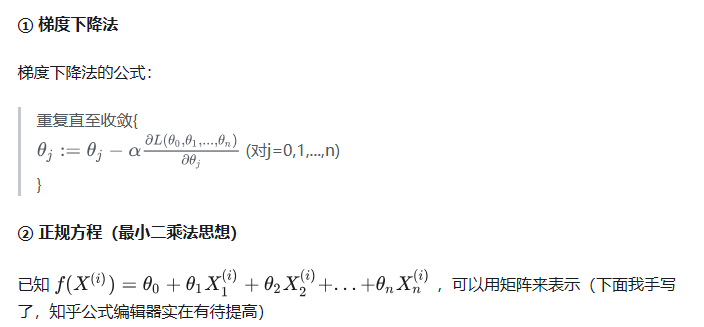

# 线性回归

###### 线性回归研究的问题：拟合一条直线，让数据点到拟合直线的距离和最小。

###### 分为一元线性回归和多元线性回归。

1. ### 一元线性回归求解：

   #### 	求解步骤

   - 1. 构建一元线性方程：
     2. 构建损失函数：
     3. 通过令损失函数最小来确定参数

   - #### 求解方法：

   - 最小二乘法

   - 

   - 

   - 梯度下降法

   - 

   - 

   - 

2. ### 多元线性求解

   - 同一元线性求解思路一样。

     1. 构建多元线性方程：

        

     2. 构建损失函数：

        

     3. 通过令损失函数最小来确定参数：

        、

        

        

        

